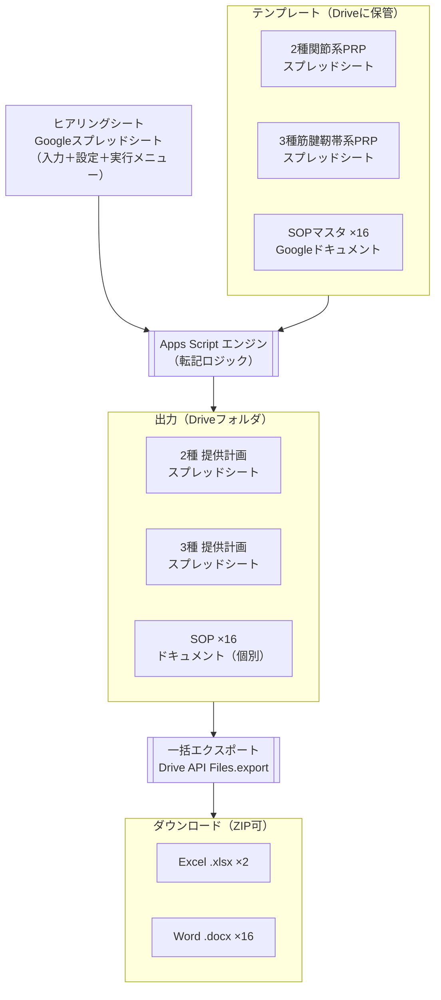

# PRP申請書類 自動転記ツール — クラウド版 構成メモ

作成日: 2026-06-30
目的: 現行のローカル版（Windows + Python）を Google Workspace 上に移したクラウド版の、使用ツール・技術構成を共有する。

---

## 1. 概要

ヒアリングシート（Googleスプレッドシート）に入力した情報を元に、提供計画（2種・3種）と SOP を自動生成する。
処理エンジンは Google Apps Script。生成物は Google 形式（スプレッドシート／ドキュメント）で出力し、必要に応じて Excel（.xlsx）・Word（.docx）へ一括書き出しする。

- 入力: ヒアリングシート（Googleスプレッドシート）
- 出力1: 2種関節系PRP・3種筋腱靭帯系PRP（Googleスプレッドシート）
- 出力2: SOP（Googleドキュメント・16個の個別ファイル）
- 一括書き出し: 提供計画 → Excel、SOP → Word

---

## 2. 使用ツール・技術スタック

| 区分 | 採用技術 | 用途 |
|---|---|---|
| 実行環境 | Google Apps Script（JavaScript） | 転記ロジック本体。サーバー不要、スプレッドシートに内蔵 |
| 入力/表計算 | Google スプレッドシート ＋ SpreadsheetApp | ヒアリング入力、提供計画テンプレの読み書き |
| 文書 | Google ドキュメント ＋ DocumentApp | SOPテンプレの複製・文字列置換 |
| ファイル管理 | Google ドライブ ＋ DriveApp | テンプレ保管、出力フォルダ、複製 |
| 形式変換 | Drive API（Advanced Service）`Files.export` | Google形式 → .xlsx / .docx / .pdf 書き出し |
| 設定 | 設定シート（マッピング表）／Script Properties | プレースホルダ・セルとヒアリング項目の対応 |
| 実行トリガ | カスタムメニュー／ボタン（onOpen） | スプレッドシート上から実行 |
| 配布 | 共有リンク（ドライブ権限） | チームへの共有・実行 |

---

## 3. 全体構成図



### ASCIIフォールバック

```
[ヒアリングシート（スプレッドシート）] ──┐
                                          │  ① 値を読む
[テンプレート（Drive）]                   ▼
  ├ 2種関節系PRP（スプレッドシート）   [Apps Script エンジン]
  ├ 3種筋腱靭帯系PRP（スプレッドシート）   │  ② 複製 ③ 置換
  └ SOPマスタ×16（ドキュメント）          ▼
                                    [出力（Driveフォルダ）]
                                      ├ 2種 提供計画（スプレッドシート）
                                      ├ 3種 提供計画（スプレッドシート）
                                      └ SOP×16（ドキュメント・個別）
                                          │  ④ 一括エクスポート
                                          ▼
                                   [Excel .xlsx ×2 ／ Word .docx ×16]（ZIP可）
```

---

## 4. コンポーネント

| # | 構成要素 | 形式 | 役割 |
|---|---|---|---|
| ① | ヒアリングシート | Googleスプレッドシート | 入力タブ／設定タブ（マッピング）／実行メニュー。Apps Script を内蔵 |
| ② | 提供計画テンプレ（2種・3種） | Googleスプレッドシート | 緑セル＝転記先。様式・複数シートを保持 |
| ③ | SOPマスタ（16） | Googleドキュメント（個別） | 本文に `{{医療機関名}}` `{{施設管理者}}` のプレースホルダ |
| ④ | マッピング設定 | 設定シート／Script Properties | 「転記先セル ↔ ヒアリング項目」「プレースホルダ ↔ ヒアリング項目」 |
| ⑤ | Apps Script エンジン | GAS（JavaScript） | 読み取り→複製→置換→出力→エクスポート |
| ⑥ | 出力フォルダ | Googleドライブ | 生成物の保存先。クリニック単位でサブフォルダ |

---

## 5. 処理フロー

1. ヒアリングシートのメニュー（またはボタン）から実行。
2. **読み取り**: `SpreadsheetApp` でヒアリング値を取得。
3. **提供計画（2種・3種）**:
   - テンプレ・スプレッドシートを `DriveApp` で複製。
   - マッピングに従い `Range.setValue()` で各セルへ転記（複数キットの①②③連番／名称・所在地の改行整形／医師複数／委員会名↔番号 等のロジックを GAS で実装）。
4. **SOP（16個別ドキュメント）**:
   - SOPマスタ16本を複製。
   - `DocumentApp` で `Body.replaceText("{{医療機関名}}", 値)` 等を実行（クリニック名・施設管理者を差し込み）。
5. **出力**: 生成物を Drive の出力フォルダ（`SOP_(クリニック名)` 等）へ保存。
6. **一括エクスポート**:
   - 提供計画スプレッドシート → `.xlsx`（Drive API `Files.export`）。
   - SOPドキュメント16本 → `.docx`。
   - 必要に応じて ZIP にまとめてダウンロード。

---

## 6. 一括エクスポートの仕組み

- Google形式 → Office形式は Drive API のエクスポートで行う（GAS の Advanced Drive Service）。
  - スプレッドシート → `application/vnd.openxmlformats-officedocument.spreadsheetml.sheet`（.xlsx）
  - ドキュメント → `application/vnd.openxmlformats-officedocument.wordprocessingml.document`（.docx）
  - PDF も同様に出力可能。
- SOPは**16個の個別ドキュメント**構成のため、ループで1本ずつ `.docx` へ書き出せる（Word一括保存が安定）。
- ※ 参考: SOPを「1ドキュメント＋16タブ」に統合する案は閲覧は楽だが、タブはWordに対応概念が無く .docx 書き出しが不安定。Word一括保存を要件とするため**個別ドキュメント構成を採用**。

---

## 7. 現行ローカル版 → クラウド版 対応表

| 項目 | 現行（ローカル） | クラウド版 |
|---|---|---|
| 実行基盤 | Windows PC | Google Workspace（ブラウザ） |
| エンジン | Python 3 | Google Apps Script（JavaScript） |
| 表計算処理 | openpyxl | SpreadsheetApp |
| 文書処理 | python-docx | DocumentApp |
| テンプレ（提供計画） | .xlsx | Googleスプレッドシート |
| テンプレ（SOP） | .docx | Googleドキュメント |
| マッピング定義 | mapping.json / sop_replacements.json | 設定シート／Script Properties |
| 起動方法 | 転記実行.bat（ダブルクリック） | スプレッドシートのメニュー／ボタン |
| 入出力場所 | 01_input / 02_output フォルダ | Googleドライブ フォルダ |
| 最終ファイル形式 | .xlsx / .docx（そのまま） | Google形式 ＋ 一括で .xlsx / .docx 書き出し |

---

## 8. 留意事項

- **個人情報・医療情報のクラウド扱い**: 患者・クリニック情報を Google ドライブで保持・処理するため、取扱い方針（社内ルール／クライアント同意）の確認が前提。
- **様式の再現性**: 提供計画は結合セル・図を含むため、Word/Excel↔Google変換でレイアウトがずれる箇所が出る可能性がある（特に SOP の組織図＝図形描画）。移行時は目視確認が必要。
- **二重変換のリスク**: 最終納品がWordの場合、Word→Googleドキュメント→Word の2回変換で崩れリスクが乗る。提出物の最終形式に応じて、Docs経由の要否を判断する。
- **Apps Script の実行制限**: 1実行あたりの実行時間・1日あたりの呼び出し回数に上限がある。大量出力時はバッチ分割を検討。

---

## 9. 初期セットアップ（クラウド版を立ち上げる際の作業）

1. 提供計画テンプレ（2種・3種 .xlsx）を Google スプレッドシートへ取り込み。
2. SOP 16本（.docx）を Google ドキュメントへ変換し、可変箇所を `{{…}}` プレースホルダ化。
3. ヒアリングシート（スプレッドシート）に設定タブ・実行メニュー（GAS）を実装。
4. 出力先 Drive フォルダ・共有権限を設定。
5. 1クリニック分でテスト出力 → 様式・図の再現を目視確認。
